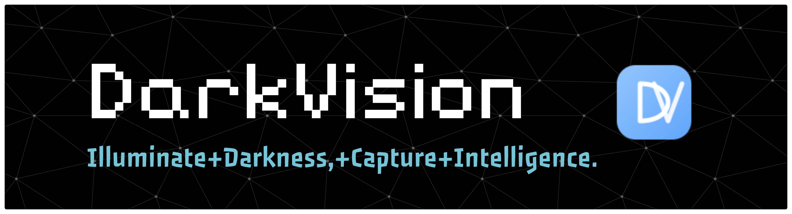

<div align="center">
  
</div>

[](https://git.io/typing-svg)


[English](./READM.md) | [中文](./README_ZH.md)

---

# DarkVision-LPR

> A low-light oriented License Plate Recognition (LPR) system with YOLOv11m, trained on CCPD2019+CCPD2020 (**30,000** images), reaching **99.9%** accuracy.

## 📚 Project Overview

**DarkVision-LPR** is a high-precision License Plate Recognition (LPR) system specifically designed for **low-light environments**. Targeting complex lighting scenarios such as nighttime, underground parking garages, and tunnels, we employ the **YOLOv11m** deep learning model combined with **Retinex image enhancement algorithms**. The system was fully trained on **30,000** images from CCPD2019 and CCPD2020 datasets, achieving a model accuracy of **99.9%**.

This project adopts a modern **frontend-backend separation** architecture, integrating **real-time data analytics**, **multi-platform adaptation** (Web client, Admin portal, Official website), and a **VIP membership system**, aiming to provide stable and efficient solutions for intelligent transportation, security monitoring, and related fields.

### Key Features

- 🌑 **Night Vision Enhancement**: Adaptive image enhancement algorithms make license plates clearly visible even in extremely dark environments
- ⚡ **Millisecond Recognition**: Real-time streaming detection based on high-performance YOLOv11m model
- 📊 **Data Insights**: Built-in powerful data analytics dashboard for real-time monitoring of recognition traffic, vehicle type distribution, and KPI metrics
- 🌐 **Full-Stack Ecosystem**: Includes user portal, admin backend, and official marketing website to meet different role requirements
- 🔒 **Enterprise-Grade Security**: Supports real-name authentication, JWT authorization, and operation log auditing
- 🔄 **Real-Time Progress**: WebSocket real-time progress push (upload/detection/enhancement/recognition four steps)
- 💾 **OSS Integration**: Aliyun OSS storage with signed URL secure access

## 🧠 Model & Dataset

### Model Architecture

- **Model Selection**: YOLOv11m (Medium), achieving optimal balance between speed and accuracy
- **Training Data**: CCPD2019 + CCPD2020 datasets (total **30,000+** samples)
- **Training Results**: Achieved **99.9%** mAP@0.5:0.95 on test set, especially optimized for skewed, blurred, and low-light plate detection
- **Enhancement Algorithm**: Retinex image enhancement optimized for low-light scenarios

### Training Visualization (Placeholder)

> *(Placeholder: Training process visualization charts such as Loss curves, mAP changes, etc.)*  
> Suggested screenshot: `docs/ai/training_metrics.png`

## 🏗️ System Architecture

DarkVision-LPR adopts a layered, decoupled cloud-native architecture design with clear module responsibilities and excellent scalability.

### Technical Architecture Diagram

> *(Placeholder: Overall system technical architecture diagram showing frontend, API gateway, backend services, AI inference service, and database interactions)*  
> Suggested screenshot: `docs/architecture/system_architecture.png`

- **Frontend Layer**: Built with Vue 3 + TypeScript, using Element Plus component library for excellent user experience
- **Gateway Layer**: FastAPI provides unified RESTful API entry, handling route distribution and authentication
- **Business Services**: Handle core business logic such as user management, recharge, and history record queries
- **AI Inference Layer**: Independently deployed inference service integrating YOLOv11m model and image preprocessing pipeline
- **Data Layer**: MySQL stores structured business data, Redis handles caching and session management, OSS object storage manages massive images

### Core Algorithms & Models

- **Detection Model**: YOLOv11m for license plate detection
- **Recognition Model**: LPRNet for character recognition
- **Enhancement Algorithm**: Retinex for low-light image enhancement
- **Real-Time Communication**: WebSocket for four-step progress push (25%/50%/75%/100%)

## 🗂️ Database Design

Core database design as follows (ER Diagram):

> *(Placeholder: Database ER diagram)*  
> Suggested screenshot: `docs/architecture/database_er.png`

### Core Data Tables

- `users` - User basic information table
- `user_profiles` - User extended information table (gender, birthday, address, etc.)
- `user_memberships` - Membership information table
- `recognition_tasks` - Recognition task table
- `recognition_results` - Recognition result table
- `recognition_statistics` - Recognition statistics table (quota management)
- `real_name_verifications` - Real-name verification table
- `sub_accounts` - Enterprise sub-account table

## ✨ Core Features

### 1. Recognition Features

- **Single Image Recognition**: Support drag-and-drop upload or click selection with real-time progress display
- **Batch Recognition**: Support multiple image batch upload (VIP feature)
- **Video Recognition**: Support video file upload (VIP feature)
- **Real-Time Progress**: WebSocket real-time push of four-step progress (Image Upload → Plate Detection → Image Enhancement → Character Recognition)

### 2. User System

- **Account Management**: Registration, login, password reset, personal profile management
- **Membership System**: Free, VIP Monthly, VIP Yearly, Enterprise
- **Quota Management**: Daily recognition quota statistics and usage tracking
- **Real-Name Authentication**: ID card upload, manual review, status query

### 3. History Records

- **Record Query**: Support filtering by date, license plate number, type
- **Data Export**: VIP users support CSV format export
- **Detail View**: View recognition details, original images, enhanced images
- **Data Statistics**: Recognition success rate, change rate compared to yesterday

### 4. Admin Backend

- **User Management**: User list, permission management, status control
- **Task Monitoring**: Real-time recognition task monitoring, failure retry
- **Data Statistics**: Platform usage, popular resource analysis
- **System Settings**: System configuration, parameter adjustment

## 🧰 Tech Stack Details

### Backend Tech Stack

| Technology | Version | Description |
| :--- | :--- | :--- |
| **Python** | 3.10+ | Core programming language |
| **FastAPI** | 0.104+ | High-performance Web framework (ASGI) |
| **YOLOv11** | v11m | Object detection core algorithm |
| **PyTorch** | 2.1.0 | Deep learning inference framework |
| **OpenCV** | 4.8+ | Image preprocessing and enhancement |
| **SQLAlchemy** | 2.0+ | Modern ORM framework |
| **MySQL** | 8.0 | Relational database |
| **Redis** | 6.x | High-speed cache and task queue |
| **Aliyun OSS** | SDK | Aliyun object storage integration |
| **WebSocket** | - | Real-time communication protocol |

### Frontend Tech Stack

| Technology | Version | Description |
| :--- | :--- | :--- |
| **Vue** | 3.3+ | Progressive JavaScript framework |
| **Vite** | 5.0+ | Next-generation frontend build tool |
| **TypeScript** | 5.0+ | Strongly typed development language |
| **Element Plus** | 2.4+ | Beautiful and practical UI component library |
| **Pinia** | 2.1+ | Modern state management library |
| **ECharts** | 5.4+ | Powerful data visualization chart library |
| **Vue Router** | 4.2+ | Route manager |
| **Axios** | 1.x | HTTP client |
| **Sass** | 1.69+ | CSS preprocessor |

## 📸 System Features & Interface Showcase

### Recognition Feature Demo

> *(Placeholder: Recognition page screenshot showing recognition results and enhancement effects after image upload)*  
> Suggested screenshot: `docs/shots/recognition.png`

### Data Analytics Dashboard

> *(Placeholder: VIP data analytics dashboard screenshot showing ECharts charts)*  
> Suggested screenshot: `docs/shots/dashboard.png`

### Admin Backend

> *(Placeholder: Admin backend screenshot showing user list and system settings)*  
> Suggested screenshot: `docs/shots/admin.png`

### History Records

> *(Placeholder: History records page screenshot)*  
> Suggested screenshot: `docs/shots/history.png`

## 📁 Project Structure

```bash
DarkVision-LPR/
├── backend/                  # Backend service root directory
│   ├── app/
│   │   ├── api/             # API routes (v1)
│   │   │   ├── v1/
│   │   │   │   ├── auth.py      # Authentication APIs
│   │   │   │   ├── recognition.py # Recognition APIs
│   │   │   │   ├── upload.py     # File upload APIs
│   │   │   │   ├── history.py    # History record APIs
│   │   │   │   ├── users.py      # User management APIs
│   │   │   │   └── websocket.py  # WebSocket APIs
│   │   ├── core/            # Core configuration and utilities
│   │   │   ├── config.py        # Configuration management
│   │   │   ├── database.py      # Database connection
│   │   │   ├── security.py      # Security utilities (JWT)
│   │   │   └── response.py     # Unified response format
│   │   ├── models/          # SQLAlchemy data models
│   │   │   ├── user.py          # User model
│   │   │   └── recognition.py   # Recognition models
│   │   ├── schemas/         # Pydantic data schemas
│   │   │   ├── user.py          # User Schema
│   │   │   └── recognition.py  # Recognition Schema
│   │   ├── services/        # Business logic service layer
│   │   │   ├── auth.py          # Authentication service
│   │   │   ├── recognition.py  # Recognition service
│   │   │   └── websocket_manager.py # WebSocket manager
│   │   ├── utils/           # Utility functions
│   │   │   ├── oss.py           # OSS utilities
│   │   │   └── ...
│   │   └── main.py          # Application entry point
│   ├── weights/             # YOLO model weight files
│   │   ├── best.pt              # YOLOv11m detection model
│   │   └── Final_LPRNet_model.pth # LPRNet recognition model
│   └── requirements.txt     # Python dependencies
│
├── frontend/                 # Frontend project collection
│   ├── user-portal/         # C-end user portal (Vue3)
│   │   ├── src/
│   │   │   ├── api/             # API interface encapsulation
│   │   │   ├── components/      # Common components
│   │   │   ├── views/           # Page components
│   │   │   ├── store/           # Pinia state management
│   │   │   └── router/          # Route configuration
│   │   └── vite.config.ts       # Vite configuration
│   ├── admin-portal/        # B-end admin backend (Vue3)
│   └── official-website/    # Official marketing website (Vue3)
│
└── docs/                    # Project documentation and resources
    ├── architecture/        # Architecture diagrams
    ├── ai/                  # AI model related
    └── shots/               # Screenshot resources
```

## 📦 Quick Deployment Guide

### Environment Requirements

- **OS**: macOS / Linux / Windows
- **Python**: 3.10+
- **Node.js**: 18+
- **Database**: MySQL 8.0+, Redis 6.0+
- **OSS**: Aliyun OSS account (optional, for image storage)

### 1. Database Preparation

#### MySQL Database Initialization

```bash
# Login to MySQL
mysql -u root -p

# Create database
CREATE DATABASE darkvision_lpr CHARACTER SET utf8mb4 COLLATE utf8mb4_unicode_ci;

# Import database structure (if SQL file exists)
mysql -u root -p darkvision_lpr < darkvision_lpr.sql
```

#### Redis Startup

```bash
# Start Redis using Docker (recommended)
docker run -d --name redis -p 6379:6379 redis:6.2-alpine

# Or use local Redis
redis-server
```

### 2. Backend Configuration & Startup

#### 2.1 Create Virtual Environment

```bash
cd backend
python -m venv venv

# macOS/Linux
source venv/bin/activate

# Windows
venv\Scripts\activate
```

#### 2.2 Install Dependencies

```bash
pip install -r requirements.txt
```

#### 2.3 Configure Environment Variables

Create a `.env` file in the `backend` directory:

```bash
# Database Configuration
MYSQL_HOST=localhost
MYSQL_PORT=3306
MYSQL_USER=root
MYSQL_PASSWORD=123456
MYSQL_DATABASE=darkvision_lpr

# Redis Configuration
REDIS_HOST=localhost
REDIS_PORT=6379
REDIS_PASSWORD=
REDIS_DB=0

# JWT Secret Key (change in production)
SECRET_KEY=your-secret-key-here-change-in-production
ALGORITHM=HS256
ACCESS_TOKEN_EXPIRE_MINUTES=10080

# OSS Configuration (Aliyun)
OSS_ENDPOINT=https://oss-cn-beijing.aliyuncs.com
OSS_ACCESS_KEY_ID=your-access-key-id
OSS_ACCESS_KEY_SECRET=your-access-key-secret
OSS_BUCKET_NAME=your-bucket-name
OSS_URL=https://your-bucket-name.oss-cn-beijing.aliyuncs.com

# Email Configuration (for verification codes)
MAIL_HOST=smtp.163.com
MAIL_PORT=465
MAIL_USERNAME=your-email@163.com
MAIL_PASSWORD=your-email-auth-code
MAIL_FROM=your-email@163.com
MAIL_FROM_NAME=DarkVision-LPR
MAIL_USE_SSL=true

# SMS Configuration (SMS Bao, optional)
SMS_PROVIDER=smsbao
SMS_API_URL=http://api.smsbao.com/sms
SMS_USER=your-sms-username
SMS_PASSWORD=your-sms-password
SMS_SIGN_NAME=DarkVision-LPR

# Real-Name Verification Configuration (Aliyun Market)
ALIYUN_MARKET_APPCODE=your-appcode

# Model Paths
YOLO_MODEL_PATH=weights/best.pt
LPRNET_MODEL_PATH=weights/Final_LPRNet_model.pth

# Development Mode
DEBUG=true
RETURN_VERIFICATION_CODE=true
```

#### 2.4 Download Model Files

Ensure the following model files exist in the `backend/weights/` directory:

- `best.pt` - YOLOv11m detection model
- `Final_LPRNet_model.pth` - LPRNet recognition model

#### 2.5 Start Backend Service

```bash
# Development mode (auto-reload)
uvicorn app.main:app --reload --host 0.0.0.0 --port 8000

# Production mode
uvicorn app.main:app --host 0.0.0.0 --port 8000 --workers 4
```

Backend service will start at `http://localhost:8000`, API documentation: `http://localhost:8000/docs`

### 3. Frontend Configuration & Startup

#### 3.1 User Portal

```bash
cd frontend/user-portal

# Install dependencies
npm install

# Start development server
npm run dev
```

Frontend service will start at `http://localhost:3001`

#### 3.2 Admin Portal

```bash
cd frontend/admin-portal

# Install dependencies
npm install

# Start development server
npm run dev
```

Admin portal will start at `http://localhost:3002`

#### 3.3 Official Website

```bash
cd frontend/official-website

# Install dependencies
npm install

# Start development server
npm run dev
```

Official website will start at `http://localhost:3000`

### 4. Frontend Environment Variables (Optional)

If you need to modify the API address, create `.env.development` files in each frontend project root:

```bash
# user-portal/.env.development
VITE_API_BASE_URL=http://localhost:8000

# admin-portal/.env.development
VITE_API_BASE_URL=http://localhost:8000
```

### 5. Verify Deployment

1. **Backend Health Check**: Visit `http://localhost:8000/docs` to view API documentation
2. **Frontend Access**: Visit `http://localhost:3001` to view user portal
3. **Database Connection**: Check backend logs to confirm database connection success
4. **Redis Connection**: Check backend logs to confirm Redis connection success

## 🔧 Configuration Guide

### Required Configuration

- **MySQL**: Database connection information
- **Redis**: Cache service connection information
- **SECRET_KEY**: JWT secret key (must be changed in production)

### Optional Configuration

- **OSS**: Image upload feature will be unavailable if not configured
- **Email Service**: Email verification code feature will be unavailable if not configured
- **SMS Service**: SMS verification code feature will be unavailable if not configured

### Production Environment Recommendations

1. **Change SECRET_KEY**: Use strong random string
2. **Disable DEBUG**: Set `DEBUG=false`
3. **Disable Verification Code Return**: Set `RETURN_VERIFICATION_CODE=false`
4. **Use HTTPS**: Configure SSL certificate
5. **Configure CORS**: Limit allowed frontend domains
6. **Database Optimization**: Configure connection pool, index optimization
7. **Redis Persistence**: Configure RDB or AOF
8. **Log Management**: Configure log rotation and monitoring

## 🔭 Roadmap

- [ ] Batch recognition UI optimization and process improvement
- [ ] Complete video recognition feature implementation
- [ ] Admin backend data analytics dashboard
- [ ] More model variants and A/B testing support
- [ ] Complete internationalization coverage
- [ ] Docker containerization deployment solution
- [ ] Kubernetes cluster deployment solution

## 🤝 Join Us

We are a passionate technical team dedicated to empowering traditional industries with AI. If you are interested in computer vision, Web development, or open-source projects, welcome to join us!

### Contact Information

<table>
<tr>
<td align="center">
<strong>QQ</strong><br/>

</td>
<td align="center">
<strong>WeChat / 微信</strong><br/>

</td>
</tr>
</table>

- **Email**: [15968588744@163.com](mailto:15968588744@163.com)
- **Phone / 手机**: 15968588744
- **QQ**: 1957689514
- **WeChat / 微信**: Lucky_ff0810

### Core Team

- **Auroral** - Project Founder & Full-Stack Architect

## ⭐ Star & Stats

[](https://star-history.com/#Auroral0810/DarkVision-LPR&Date)


---

<div align="center">
  <p>Made with ❤️ by DarkVision Team</p>
  <p>© 2026 DarkVision-LPR. All rights reserved.</p>
</div>

