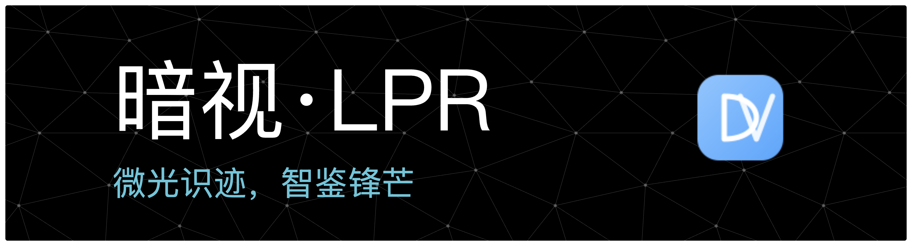

<div align="center">
  
</div>

[](https://git.io/typing-svg)


[English](./README_EN.md) | [中文](./README.md)

---

# DarkVision-LPR

> 面向低光照场景的车牌识别系统，使用 YOLOv11m 在 CCPD2019+CCPD2020（3万张）训练，精度 **99.9%**。

## 📚 项目概述

**DarkVision-LPR** 是一款专为**低光照环境**设计的高精度车牌识别系统。针对夜间、地下车库、隧道等复杂光线场景，我们采用了**YOLOv11m**深度学习模型，并结合**Retinex图像增强算法**，在 CC PD2019 和 CCPD2020 数据集上通过**3万张**图像进行了充分训练，模型准确率高达 **99.9%**。

本项目采用现代化的**前后端分离**架构，集成了**实时数据分析**、**多端适配**（Web端、管理端、官网）以及**VIP会员体系**，旨在为智能交通、安防监控等领域提供稳定、高效的解决方案。

### 核心特性

- 🌑 **夜视增强**：自适应图像增强算法，让极暗环境下的车牌也清晰可见
- ⚡ **毫秒级识别**：基于高性能 YOLOv11m 模型，实现实时流媒体检测
- 📊 **数据洞察**：内置强大的数据分析大屏，实时监控识别流量、车型分布及 KPI 指标
- 🌐 **全栈生态**：包含用户门户、管理后台及官方宣传网站，满足不同角色需求
- 🔒 **企业级安全**：支持实名认证、JWT 鉴权及操作日志审计
- 🔄 **实时进度**：WebSocket 实时推送识别进度（上传/检测/增强/识别四步骤）
- 💾 **OSS 集成**：阿里云 OSS 存储，支持签名 URL 安全访问

## 🧠 模型与数据集

### 模型架构

- **模型选择**：YOLOv11m (Medium)，在速度与精度之间取得最佳平衡
- **训练数据**：CCPD2019 + CCPD2020 数据集（共 **30,000+** 样本）
- **训练成果**：在测试集上 mAP@0.5:0.95 达到 **99.9%**，尤其优化了倾斜、模糊及低光照样本的检测能力
- **增强算法**：Retinex 图像增强，针对低光照场景优化

### 训练可视化（预留）

> *（预留：此处放置模型训练过程的可视化图表，如 Loss 曲线、mAP 变化图等）*  
> 建议截图：`docs/ai/training_metrics.png`

## 🏗️ 系统架构

DarkVision-LPR 采用分层解耦的云原生架构设计，各模块职责清晰，具备良好的扩展性。

### 技术架构图

> *（预留：此处放置系统的整体技术架构图，展示前端、API网关、后端服务、AI推理服务及数据库的交互关系）*  
> 建议截图：`docs/architecture/system_architecture.png`

- **前端层**：基于 Vue 3 + TypeScript 构建，使用 Element Plus 组件库，提供极致的用户体验
- **网关层**：FastAPI 提供统一的 RESTful API 入口，处理路由分发与鉴权
- **业务服务**：处理用户管理、充值、历史记录查询等核心业务逻辑
- **AI 推理层**：独立部署的推理服务，集成 YOLOv11m 模型与图像预处理管线
- **数据层**：MySQL 存储结构化业务数据，Redis 负责缓存与会话管理，OSS 对象存储管理海量图片

### 核心算法与模型

- **检测模型**：YOLOv11m 用于车牌检测
- **识别模型**：LPRNet 用于字符识别
- **增强算法**：Retinex 用于低光照图像增强
- **实时通信**：WebSocket 实现四步骤进度推送（25%/50%/75%/100%）

## 🗂️ 数据库设计

系统核心数据库设计如下（ER图）：

> *（预留：此处放置数据库 ER 图）*  
> 建议截图：`docs/architecture/database_er.png`

### 核心数据表

- `users` - 用户基础信息表
- `user_profiles` - 用户扩展信息表（性别、生日、地址等）
- `user_memberships` - 会员信息表
- `recognition_tasks` - 识别任务表
- `recognition_results` - 识别结果表
- `recognition_statistics` - 识别统计表（限额管理）
- `real_name_verifications` - 实名认证表
- `sub_accounts` - 企业子账户表

## ✨ 核心功能

### 1. 识别功能

- **单张识别**：支持拖拽上传或点击选择，实时显示识别进度
- **批量识别**：支持多张图片批量上传（VIP功能）
- **视频识别**：支持视频文件上传（VIP功能）
- **实时进度**：WebSocket 实时推送四步骤进度（图片上传→车牌检测→图像增强→字符识别）

### 2. 用户系统

- **账户管理**：注册、登录、密码重置、个人资料管理
- **会员体系**：免费版、VIP月付、VIP年付、企业版
- **额度管理**：每日识别额度统计、使用情况追踪
- **实名认证**：身份证上传、人工审核、状态查询

### 3. 历史记录

- **记录查询**：支持按日期、车牌号、类型筛选
- **数据导出**：VIP 用户支持 CSV 格式导出
- **详情查看**：查看识别详情、原始图片、增强图片
- **数据统计**：识别成功率、较昨日变化率

### 4. 管理后台

- **用户管理**：用户列表、权限管理、状态控制
- **任务监控**：识别任务实时监控、失败重试
- **数据统计**：平台使用情况、热门资源分析
- **系统设置**：系统配置、参数调整

## 🧰 技术栈详解

### 后端技术栈

| 技术 | 版本 | 说明 |
| :--- | :--- | :--- |
| **Python** | 3.10+ | 核心编程语言 |
| **FastAPI** | 0.104+ | 高性能 Web 框架 (ASGI) |
| **YOLOv11** | v11m | 目标检测核心算法 |
| **PyTorch** | 2.1.0 | 深度学习推理框架 |
| **OpenCV** | 4.8+ | 图像预处理与增强 |
| **SQLAlchemy** | 2.0+ | 现代 ORM 框架 |
| **MySQL** | 8.0 | 关系型数据库 |
| **Redis** | 6.x | 高速缓存与任务队列 |
| **Aliyun OSS** | SDK | 阿里云对象存储集成 |
| **WebSocket** | - | 实时通信协议 |

### 前端技术栈

| 技术 | 版本 | 说明 |
| :--- | :--- | :--- |
| **Vue** | 3.3+ | 渐进式 JavaScript 框架 |
| **Vite** | 5.0+ | 下一代前端构建工具 |
| **TypeScript** | 5.0+ | 强类型开发语言 |
| **Element Plus** | 2.4+ | 既美观又实用的 UI 组件库 |
| **Pinia** | 2.1+ | 现代化状态管理库 |
| **ECharts** | 5.4+ | 强大的数据可视化图表库 |
| **Vue Router** | 4.2+ | 路由管理器 |
| **Axios** | 1.x | HTTP 客户端 |
| **Sass** | 1.69+ | CSS 预处理器 |

## 📸 系统功能与界面展示

### 识别功能演示

> *（预留：此处放置识别页面的截图，展示上传图片后的识别结果与增强效果）*  
> 建议截图：`docs/shots/recognition.png`

### 数据分析大屏

> *（预留：此处放置 VIP 数据分析大屏的截图，展示 ECharts 图表）*  
> 建议截图：`docs/shots/dashboard.png`

### 管理后台

> *（预留：此处放置管理员后台的截图，展示用户列表与系统设置）*  
> 建议截图：`docs/shots/admin.png`

### 历史记录

> *（预留：此处放置历史记录页面的截图）*  
> 建议截图：`docs/shots/history.png`

## 📁 项目结构

```bash
DarkVision-LPR/
├── backend/                  # 后端服务根目录
│   ├── app/
│   │   ├── api/             # API 路由 (v1)
│   │   │   ├── v1/
│   │   │   │   ├── auth.py      # 认证相关接口
│   │   │   │   ├── recognition.py # 识别相关接口
│   │   │   │   ├── upload.py     # 文件上传接口
│   │   │   │   ├── history.py    # 历史记录接口
│   │   │   │   ├── users.py      # 用户管理接口
│   │   │   │   └── websocket.py  # WebSocket 接口
│   │   ├── core/            # 核心配置与工具
│   │   │   ├── config.py        # 配置管理
│   │   │   ├── database.py      # 数据库连接
│   │   │   ├── security.py      # 安全工具（JWT）
│   │   │   └── response.py     # 统一响应格式
│   │   ├── models/          # SQLAlchemy 数据模型
│   │   │   ├── user.py          # 用户模型
│   │   │   └── recognition.py   # 识别相关模型
│   │   ├── schemas/         # Pydantic 数据模式
│   │   │   ├── user.py          # 用户 Schema
│   │   │   └── recognition.py   # 识别 Schema
│   │   ├── services/        # 业务逻辑服务层
│   │   │   ├── auth.py          # 认证服务
│   │   │   ├── recognition.py  # 识别服务
│   │   │   └── websocket_manager.py # WebSocket 管理
│   │   ├── utils/           # 工具函数
│   │   │   ├── oss.py           # OSS 工具
│   │   │   └── ...
│   │   └── main.py          # 程序入口
│   ├── weights/             # YOLO 模型权重文件
│   │   ├── best.pt              # YOLOv11m 检测模型
│   │   └── Final_LPRNet_model.pth # LPRNet 识别模型
│   └── requirements.txt     # Python 依赖
│
├── frontend/                 # 前端项目集合
│   ├── user-portal/         # C端用户门户 (Vue3)
│   │   ├── src/
│   │   │   ├── api/             # API 接口封装
│   │   │   ├── components/      # 公共组件
│   │   │   ├── views/           # 页面组件
│   │   │   ├── store/           # Pinia 状态管理
│   │   │   └── router/          # 路由配置
│   │   └── vite.config.ts       # Vite 配置
│   ├── admin-portal/        # B端管理后台 (Vue3)
│   └── official-website/    # 官方宣传网站 (Vue3)
│
└── docs/                    # 项目文档与资源
    ├── architecture/        # 架构图
    ├── ai/                  # AI 模型相关
    └── shots/               # 截图资源
```

## 📦 快速部署指南

### 环境要求

- **OS**: macOS / Linux / Windows
- **Python**: 3.10+
- **Node.js**: 18+
- **Database**: MySQL 8.0+, Redis 6.0+
- **OSS**: 阿里云 OSS 账户（可选，用于图片存储）

### 1. 数据库准备

#### MySQL 数据库初始化

```bash
# 登录 MySQL
mysql -u root -p

# 创建数据库
CREATE DATABASE darkvision_lpr CHARACTER SET utf8mb4 COLLATE utf8mb4_unicode_ci;

# 导入数据库结构（如果已有 SQL 文件）
mysql -u root -p darkvision_lpr < darkvision_lpr.sql
```

#### Redis 启动

```bash
# 使用 Docker 启动 Redis（推荐）
docker run -d --name redis -p 6379:6379 redis:6.2-alpine

# 或使用本地 Redis
redis-server
```

### 2. 后端配置与启动

#### 2.1 创建虚拟环境

```bash
cd backend
python -m venv venv

# macOS/Linux
source venv/bin/activate

# Windows
venv\Scripts\activate
```

#### 2.2 安装依赖

```bash
pip install -r requirements.txt
```

#### 2.3 配置环境变量

在 `backend` 目录下创建 `.env` 文件：

```bash
# 数据库配置
MYSQL_HOST=localhost
MYSQL_PORT=3306
MYSQL_USER=root
MYSQL_PASSWORD=123456
MYSQL_DATABASE=darkvision_lpr

# Redis 配置
REDIS_HOST=localhost
REDIS_PORT=6379
REDIS_PASSWORD=
REDIS_DB=0

# JWT 密钥（生产环境请修改）
SECRET_KEY=your-secret-key-here-change-in-production
ALGORITHM=HS256
ACCESS_TOKEN_EXPIRE_MINUTES=10080

# OSS 配置（阿里云）
OSS_ENDPOINT=https://oss-cn-beijing.aliyuncs.com
OSS_ACCESS_KEY_ID=your-access-key-id
OSS_ACCESS_KEY_SECRET=your-access-key-secret
OSS_BUCKET_NAME=your-bucket-name
OSS_URL=https://your-bucket-name.oss-cn-beijing.aliyuncs.com

# 邮件配置（用于发送验证码）
MAIL_HOST=smtp.163.com
MAIL_PORT=465
MAIL_USERNAME=your-email@163.com
MAIL_PASSWORD=your-email-auth-code
MAIL_FROM=your-email@163.com
MAIL_FROM_NAME=DarkVision-LPR
MAIL_USE_SSL=true

# 短信配置（短信宝，可选）
SMS_PROVIDER=smsbao
SMS_API_URL=http://api.smsbao.com/sms
SMS_USER=your-sms-username
SMS_PASSWORD=your-sms-password
SMS_SIGN_NAME=DarkVision-LPR

# 实名认证配置（阿里云市场）
ALIYUN_MARKET_APPCODE=your-appcode

# 模型路径
YOLO_MODEL_PATH=weights/best.pt
LPRNET_MODEL_PATH=weights/Final_LPRNet_model.pth

# 开发模式
DEBUG=true
RETURN_VERIFICATION_CODE=true
```

#### 2.4 下载模型文件

确保以下模型文件存在于 `backend/weights/` 目录：

- `best.pt` - YOLOv11m 检测模型
- `Final_LPRNet_model.pth` - LPRNet 识别模型

#### 2.5 启动后端服务

```bash
# 开发模式（自动重载）
uvicorn app.main:app --reload --host 0.0.0.0 --port 8000

# 生产模式
uvicorn app.main:app --host 0.0.0.0 --port 8000 --workers 4
```

后端服务将在 `http://localhost:8000` 启动，API 文档访问地址：`http://localhost:8000/docs`

### 3. 前端配置与启动

#### 3.1 用户门户（User Portal）

```bash
cd frontend/user-portal

# 安装依赖
npm install

# 启动开发服务器
npm run dev
```

前端服务将在 `http://localhost:3001` 启动

#### 3.2 管理后台（Admin Portal）

```bash
cd frontend/admin-portal

# 安装依赖
npm install

# 启动开发服务器
npm run dev
```

管理后台将在 `http://localhost:3002` 启动

#### 3.3 官网（Official Website）

```bash
cd frontend/official-website

# 安装依赖
npm install

# 启动开发服务器
npm run dev
```

官网将在 `http://localhost:3000` 启动

### 4. 前端环境变量配置（可选）

如果需要修改 API 地址，可以在各前端项目的根目录创建 `.env.development` 文件：

```bash
# user-portal/.env.development
VITE_API_BASE_URL=http://localhost:8000

# admin-portal/.env.development
VITE_API_BASE_URL=http://localhost:8000
```

### 5. 验证部署

1. **后端健康检查**：访问 `http://localhost:8000/docs` 查看 API 文档
2. **前端访问**：访问 `http://localhost:3001` 查看用户门户
3. **数据库连接**：检查后端日志确认数据库连接成功
4. **Redis 连接**：检查后端日志确认 Redis 连接成功

## 🔧 配置说明

### 必需配置

- **MySQL**：数据库连接信息
- **Redis**：缓存服务连接信息
- **SECRET_KEY**：JWT 密钥（生产环境必须修改）

### 可选配置

- **OSS**：如果不配置，图片上传功能将不可用
- **邮件服务**：如果不配置，邮箱验证码功能将不可用
- **短信服务**：如果不配置，手机验证码功能将不可用

### 生产环境建议

1. **修改 SECRET_KEY**：使用强随机字符串
2. **关闭 DEBUG**：设置 `DEBUG=false`
3. **关闭验证码返回**：设置 `RETURN_VERIFICATION_CODE=false`
4. **使用 HTTPS**：配置 SSL 证书
5. **配置 CORS**：限制允许的前端域名
6. **数据库优化**：配置连接池、索引优化
7. **Redis 持久化**：配置 RDB 或 AOF
8. **日志管理**：配置日志轮转和监控

## 🔭 功能规划

- [ ] 批量识别 UI 优化与流程完善
- [ ] 视频识别功能完整实现
- [ ] 管理后台数据分析大屏
- [ ] 更多模型变体与 A/B 测试支持
- [ ] 国际化完整覆盖
- [ ] Docker 容器化部署方案
- [ ] Kubernetes 集群部署方案

## 🤝 加入我们

我们是一支充满激情的技术团队，致力于用 AI 赋能传统行业。如果您对计算机视觉、Web 开发或开源项目感兴趣，欢迎加入我们！

### 联系方式

<table>
<tr>
<td align="center">
<strong>QQ</strong><br/>

</td>
<td align="center">
<strong>WeChat / 微信</strong><br/>

</td>
</tr>
</table>

- **Email**: [15968588744@163.com](mailto:15968588744@163.com)
- **Phone / 手机**: 15968588744
- **QQ**: 1957689514
- **WeChat / 微信**: Lucky_ff0810

### 核心成员

- **Auroral** - 项目发起人 & 全栈架构师

## ⭐ Star & Stats · Star 历史与统计

[](https://starchart.cc/Auroral0810/DarkVision-LPR)


---

<div align="center">
  <p>Made with ❤️ by DarkVision Team</p>
  <p>© 2026 DarkVision-LPR. All rights reserved.</p>
</div>
